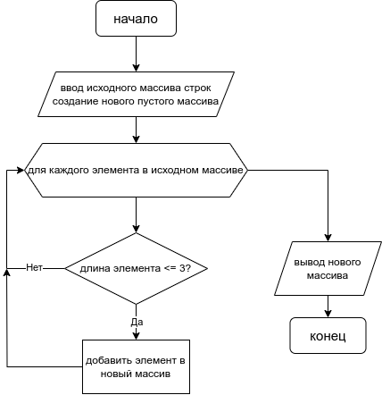

# Описание решения

Блок схема описывает общий принцип решения задачи:



Для решения поставленной задачи в коде, было принято решение реализовать
два основных метода и метод вывода массива на печать:

1. Метод _DeterminingSizeNewArray_ вычисляет длину будущего 
массива на основе количества элементов исходного массива удовлетворяющих
условию - _**<= 3**_

```C#
int DeterminingSizeNewArray(string[] sarray)
{
    int length = 0;
    foreach (string element in sarray)
        if (element.Length <= 3) length++;

    return length;
}
```

2. Метод _FormingNewArray_ формирует новый массив строк из элементов
удовлетворяющих тому же условию  - _**<= 3**_

```C#
string[] FormingNewArray(int size, string[] array)
{
    int position = 0;
    string[] threeArr = new string[size];
    for (int i = 0; i < array.Length; i++)
    {
        if (array[i].Length <= 3)
        {
            threeArr[position] = array[i];
            position++;
        }
    }

    return threeArr;
}
```

3. Метод _PrintArray_ выводит элементы массива оформленные 
в квадратных скобках "[a, b, c... ]" через запятую

```C#
void PrintArray(string[] snarray)
{
    Console.Write("[");
    Console.Write(string.Join(", ", snarray));
    Console.WriteLine("]");
}
```

Далее программа получает на вход исходный массив _sourceArray_ 
и _newArray_ - который заполняется с помощью выше описанных методов.